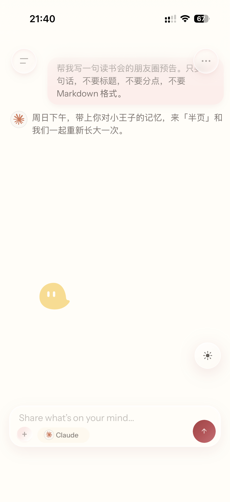
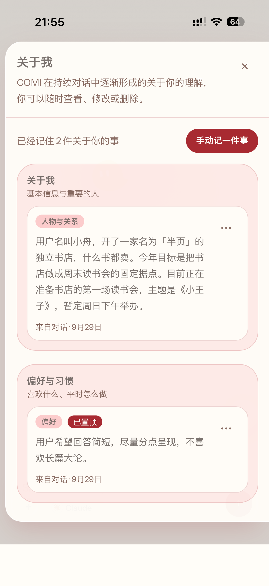
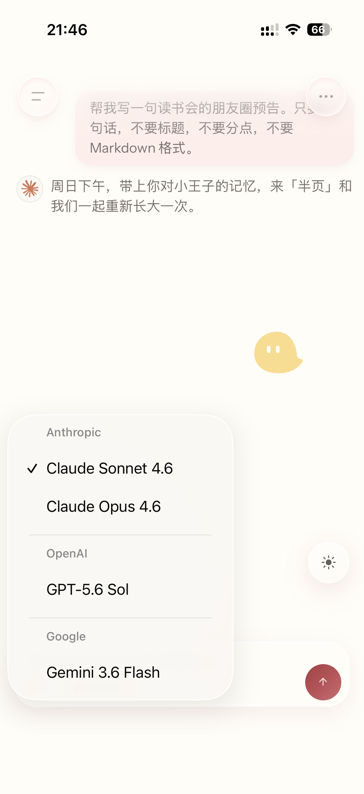
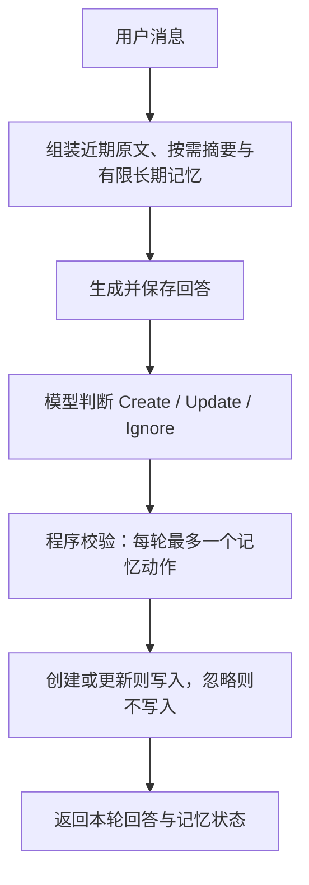

# COMI｜面向长期 AI 使用的个人 AI 伙伴

COMI 让个人上下文在多次会话与模型切换中延续，减少反复介绍背景的负担，并让 AI 的记忆可见、可纠正。

**当前实现**：可运行的 Web 产品，支持长期记忆管理、同一用户跨会话共享记忆、同一对话内模型切换，以及 About You 记忆反馈。

**我的角色**：负责产品定义与范围、交互体验、Prompt 与长期记忆策略设计；将产品方案转化为可运行原型，通过 AI-assisted development 持续迭代，并开展用户测试、问题记录及 Demo 与作品集整理。

[查看完整产品作品集 →](https://pm.leona-liu.com)

## 产品体验

  
   
  <b>跨会话长期记忆</b>
   
  新会话中无需重复背景，COMI 会调用此前保存并由用户纠正过的长期记忆。

  
   
  <b>可控的 About You</b>
   
  COMI 自动整理关于用户的理解，用户可以查看、修改、删除和置顶记忆。

  
   
  <b>同一上下文中的模型切换</b>
   
  在同一段对话里切换不同模型，继续使用已有的会话上下文和长期记忆。

## 为什么做 COMI

长期 AI 使用的难点，不只在于一次回答是否准确，还在于“它是否接得住之前的我”。进入新会话、切换模型时，用户的身份、偏好与目标容易被重新当作未知信息；已经形成的理解，也可能隐藏在无法查看、难以纠正的记忆中。

COMI 的产品命题是：**让个人上下文能够持续积累，同时让用户掌握纠正 AI 理解的主动权。** 围绕这一命题，产品优先建设对话连续性和记忆控制，而不是不断增加新的交互入口。

## 已实现的核心体验

| 能力 | 用户可以做什么 |
| --- | --- |
| 可控的长期记忆 | 查看、编辑、删除和置顶记忆，主动修正 AI 对自己的理解 |
| 跨会话共享记忆 | 同一用户的新会话继续使用同一份记忆库；每次回答按规则选择有限记忆 |
| 对话内模型切换 | 在当前会话中切换模型，利用已有原文／摘要与个人记忆接着讨论 |
| About You／记忆反馈 | 从“关于你”进入记忆面板，查看记忆；自动创建或更新后获得轻量提示 |

补充能力：多会话管理、单张图片输入与当轮视觉请求、备份导出与合并恢复、表情包，以及 PWA 安装基础。

## 两个关键产品判断

**1. 记忆的价值，也取决于用户能否纠正它。**

自动记忆降低了手动维护的负担，但 AI 的理解仍可能出错。因此，COMI 同时保留自动更新与人工编辑、删除、置顶，让记忆成为用户能够管理的信息。About You 入口与记忆反馈，则帮助用户发现和检查这些变化。

**2. 近期原文、摘要与长期记忆需要各司其职。**

只保留原文会让上下文持续增长；只依赖摘要容易丢失细节；长期记忆又不能替代当前话题。COMI 用近期原文承接讨论，用按需摘要压缩较早内容，用长期记忆保留跨会话可复用的信息，在连续性与上下文规模之间作出取舍。

## 长期记忆如何工作

回答前，系统按**置顶、重要性、更新时间**排序选择记忆，最多注入 **12 条、4,000 字符**。这是有限记忆文本注入，不是全部 Memory 整包注入，也不使用向量检索、RAG 或语义相关性检索。

每轮回答保存后，再由模型判断是否形成或更新记忆，程序校验后执行。用户始终可以人工查看和纠正。**当前记忆提取仍在响应等待链路中**，提取失败有降级处理。

实现入口：[聊天主流程](server/chat/persistent-chat-service.ts) · [记忆策略](server/memory/memory-policy.ts) · [记忆注入](server/memory/memory-context-builder.ts)

## 验证与边界

[作品集](https://pm.leona-liu.com)记录了 **n=4 的探索性用户测试**，关注首次理解、记忆控制与陪伴体验。一项观察是：用户既会在对话里纠正 AI，也会进入记忆库修改。这提示后续验证应同时关注两条修正路径，以及反馈是否足够清楚。

公开分享也获得了用户关注和私信反馈。这些是早期兴趣与可用性信号；长期留存、记忆准确率和效率提升仍待验证。上述功能状态依据当前代码，不代表所有能力均经过线上或长期用户验证。

当前产品边界：

- 非流式聊天；记忆可能出错或过时，自动更新不保证每次成功。
- 每条消息最多一张图片，只有当轮新图片传给模型；不支持通用文件知识库。
- 同一对话内切换模型，不等于多个模型同时协作。
- 支持受控测试参与者隔离，尚非开放注册的多用户平台；陪伴角色运行于页面内。

**Future Explorations（探索中）**：LLM Roundtable／多模型交叉验证与独立桌面联动，作为后续探索方向。

## 技术与运行入口

仓库沿用 Berry Chat v2 名称，当前产品为 COMI。技术基础为 Next.js / React / TypeScript、Supabase，以及通过 OriginRouter 兼容接口调用的外部模型。

本地运行概要

需要 Node.js / npm、模型服务与 Supabase 环境。

1. 执行 `npm ci`；参考 `.env.example` 配置 `.env.local`。
2. 在自己的测试数据库按顺序应用 `supabase/migrations/`，配置有效的 `BERRY_OWNER_ID`。
3. 执行 `npm run dev`，访问本地 3000 端口。

生产私密访问另需设置不同值的 `BERRY_ACCESS_CODE` 与 `BERRY_SESSION_SECRET`；图片功能依赖 Storage 配置。真实凭据不提交到仓库。

